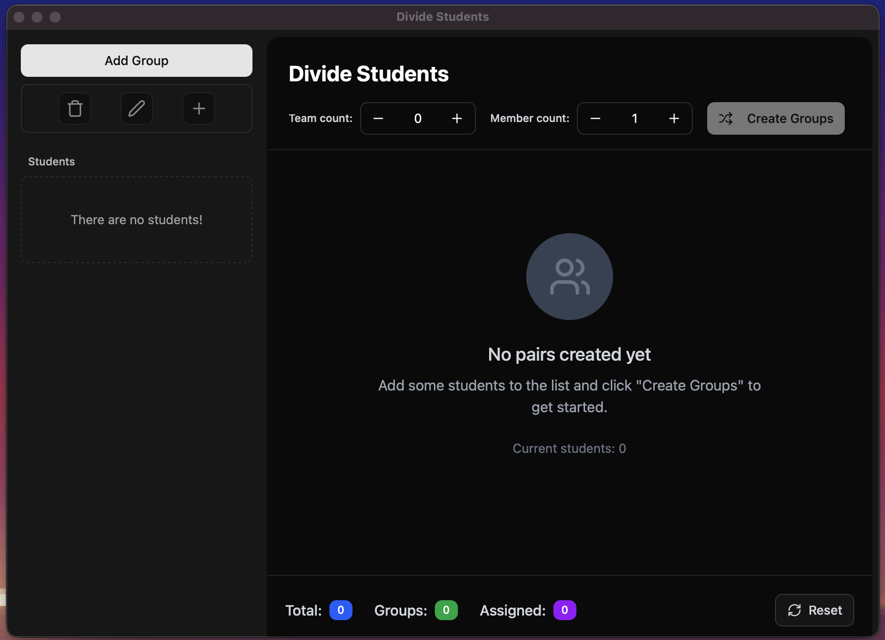
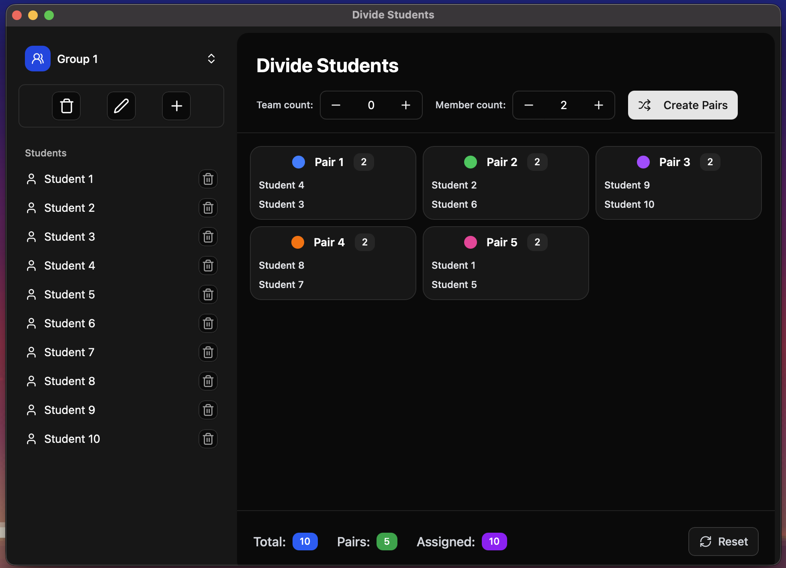
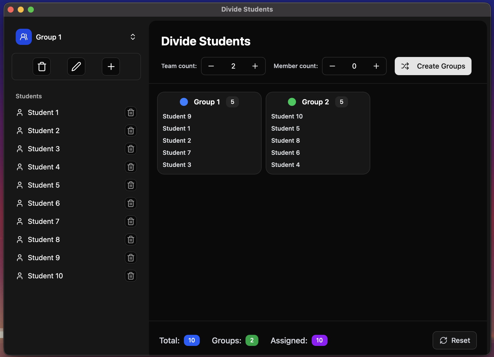

# Pair Students Desktop Application

This application helps in efficiently pairing students for various activities, projects, or group assignments. It provides a user-friendly interface to manage student lists and generate fair and random pairings based on configurable criteria.

## Evolution of the Project

This is a modern rewrite of an earlier version of the application. The previous iteration was built using **Python** and relied on the **PySide** framework for its graphical user interface. While the Python/PySide version served its purpose, this new version aims to provide a more robust, performant, and maintainable solution leveraging modern desktop application development frameworks.

## Current Version

The current version of the "Pair Students" application is built using a combination of **Tauri**, **React**, and **TypeScript**. This stack allows for the creation of a fast, secure, and cross-platform desktop application with a flexible and interactive user interface.

## Screenshots

Here are some screenshots demonstrating the application's interface and functionality:


_A view of the main application window, showing student list management._


_An example of the generated student pairings._


_An example of the generated groups._

## Getting Started

To get the application up and running on your local machine, follow these steps:

1.  **Clone the repository:**
    ```bash
    git clone https://github.com/ahrorbeksoft/studentsDivider2.git
    cd studentsDivider2
    ```
2.  **Install dependencies:**
    ```bash
    npm install
    ```
3.  **Run the application in development mode:**
    ```bash
    npm run tauri dev
    ```
4.  **Build the application for production:**
    ```bash
    npm run tauri build
    ```

## Contributing

We welcome contributions to the Pair Students application! If you'd like to contribute, please follow these steps:

1.  Fork the repository.
2.  Create a new branch for your feature or bug fix.
3.  Make your changes and ensure they adhere to the project's coding style.
4.  Write clear and concise commit messages.
5.  Submit a pull request.

## License

This project is licensed under the [MIT License](LICENSE).
